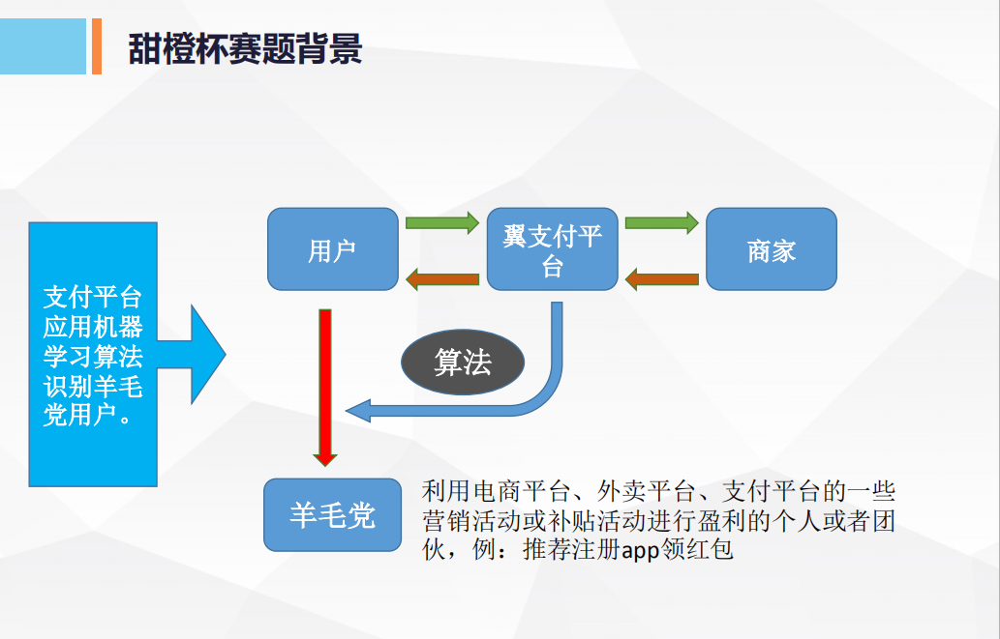
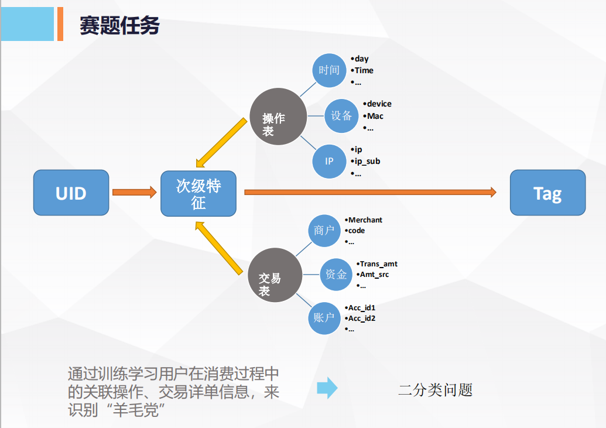
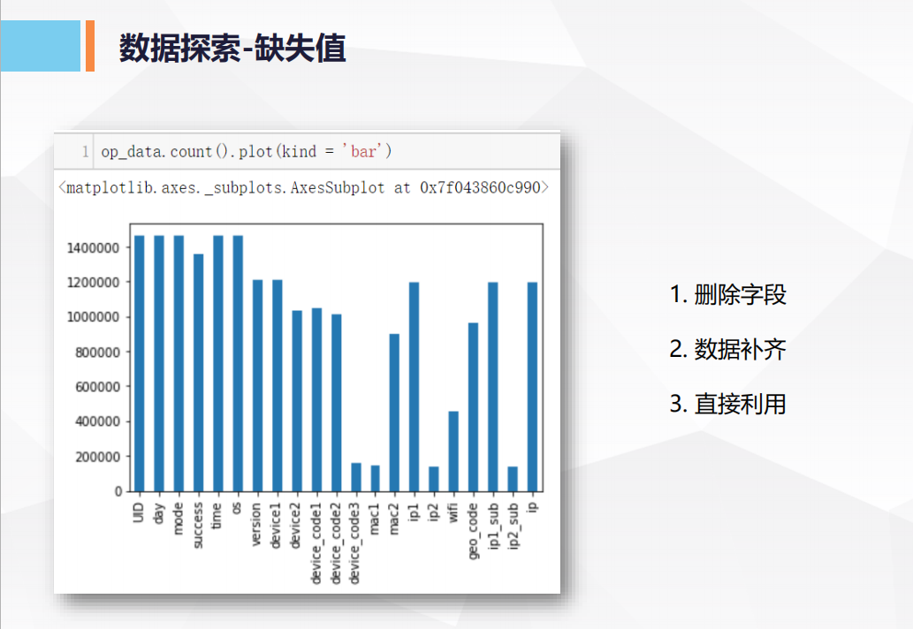
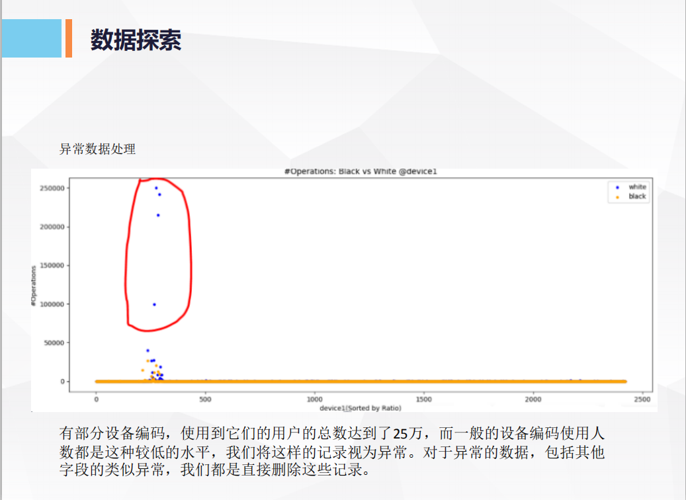
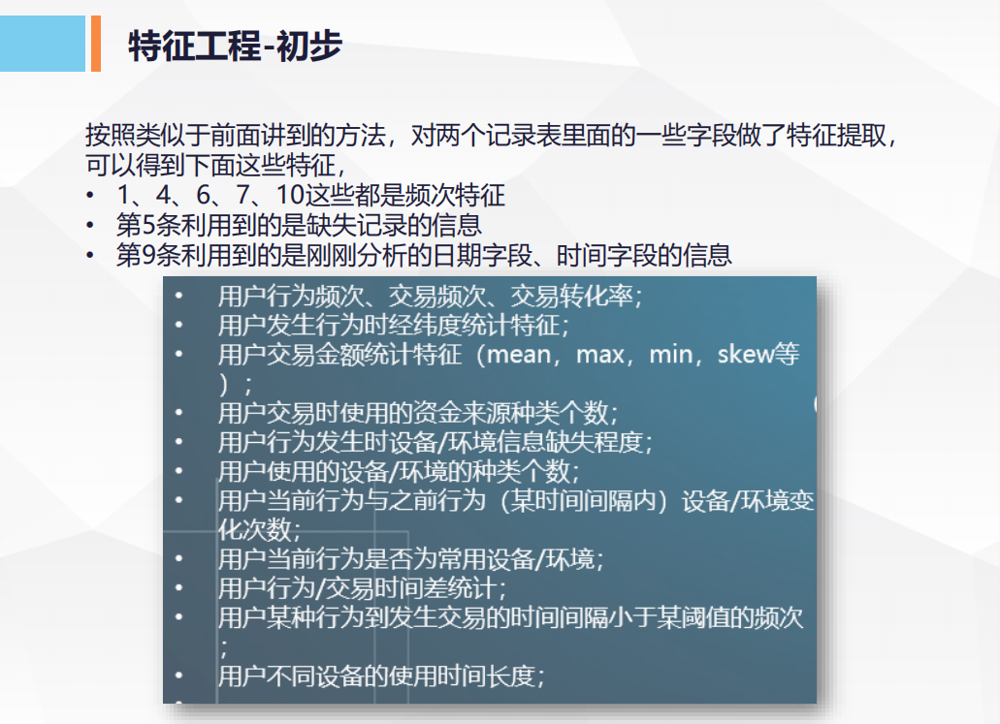

# 第一次周报

### 姓名：陈明亮

### 学号：16340023


## Part One. 前两周实训任务的总结

1. 首先复习编程语言`Python`的语法以及使用技巧，同时针对课程需要用到的数据挖掘模型，如：`Xgboost`, `LGBM`等模型进行基本的语法熟悉，了解每个参数代表的意义，尽可能地明白每个模型背后的数学原理。

   ​

2. 学习数据预处理的基本方法，包括数据归一化，数据清洗，噪声数据删除等操作，熟悉提取特征步骤的通用方法，当遇到非数值型字段时，可以采用哈希，编码等步骤进行特征值转换。

   ​

3. 报名参加2018甜橙金融杯大数据建模大赛，同时通过已学习的知识，在`TA`所给的`baseline`上，进行改进，然后将初步获得的成果提交到`OJ`上进行评测，查看获得的分数，并进行分析评估。

   ​


## Part Two. 数据预处理方法的学习

数据预处理可以提高数据的质量，从而有助于提高后续学习过程的精度和性能。通常预处理方法包含以下几种：

  1. 数据清理

* 数据清理通过填充缺失值，光滑噪声，识别离群点，并纠正数据中的不一致等技术来进行。这里我们主要介绍缺失值、噪声数据和不一致数据的数据清理方法。

  ​

* 缺失值填充：缺失值对于无监督学习结果会带来影响，通常采用以下方法进行填充：

  1. 删除含有缺失值的样本：无监督学习过程中不使用有缺失值的元组，即在无监督学习过程中删除含有缺失值的样本。此方法的缺点是删除含有缺失值的样本可能使得留下的样本用于学习的样本不能完全正确反映原始数据的分布状态，使得学习结果偏离真实情况，不能发现数据的原始分布。因此该方法不是很有效的样本缺失值处理方法，除非元组有多个属性值空缺时才采用此方法，否则不采用此方法。

     ​

  2. 人工填写缺失值：该方法就是人工补充样本的缺失值，因此非常费时，不适于大规模数据集的无监督学习数据预处理。

     ​

  3. 使用一个全局常量填充缺失值：该方法虽然简单，但并不是很可靠，因为仍然存在偏离数据原始分布信息的问题。从而使得学习结果无法发现所学习数据中隐藏的真实信息。

     ​

  4. 使用属性的均值填充缺失值：该方法相对上一方法要好些，但仍然存在偏离原始数据分布信息的潜在危险。

     ​

  5. 使用与给定元组同一类的所有样本的属性均值填充相应的缺失值：该方法比使用属性均值填充缺失值更好，更能接近原始数据的分部信息。

     ​

  6. 使用最可能的值填充缺失值：可以使用回归、决策树归纳来确定最有可能的值来填充缺失信息。该方法是填充缺失值的最好方法。

     ​

     总结以上填充缺失值的方法可见：方法3~6填充的值都有可能不正确。但与其他方法相比，方法6是最常用和最可靠的填充缺失值的方法，它使用已有数据的大部分信息来预测缺失值，但确实消耗时间成本，最为复杂的缺失值填充方法，如果并非对数据预处理保持高要求态度，可以采用直接删除法，或者人工填充即可。

     ​

* 噪声平滑：噪声`noise`是被测量变量的随机误差或偏差。给定一个数值属性，可以使用以下数据光滑技术来平滑噪声。

  1. 分箱`binning`法：通过考察数据的“近邻”（即周围的数据值）来光滑存储数据的值。存储的值被划分到一些箱中。由于仅考察近邻的值，所以分箱方法进行的是局部光滑。 

     ​

  2.  回归法：使用拟合数据函数来光滑数据（如，回归函数）。线性回归涉及找出拟合两个属性的最佳线，使得一个属性能够预测另一个。多元线性回归是线性回归的扩展，涉及多个属性，将数据拟合到一个多维曲面。利用回归方法获得拟合函数，能够帮助平滑数据并消除噪音数据。

     ​

  3. 聚类法：使用聚类来检测离群点。将相似的样本归为一个类簇，簇内极其相似而簇间极不相似。则落在簇之外的样本被直观地视为离群点。

     ​

* 不一致数据清理：在实际数据库中，由于一些人为因素或者其他原因，记录的数据可能存在不一致的情况，因此，需要对这些不一致数据在分析前需要进行清理。例如，数据输入时的错误，可通过和原始记录对比进行更正。知识工程工具也可以用来检测违反规则的数据。还例如，在已知属性间依赖关系的情况下，可以查找违反函数依赖的值。

  ​

* 数据清理是一项繁重的任务。数据清理过程的第一步是偏差检测。引起偏差的因素会有多种，如人为错误、数据退化、有意错误等。通过把握数据趋势和识别异常来发现噪音、离群点以及考察不寻常的值。除考虑由字段过载引起的错误之外，数据分析还应根据唯一性规则、连续型规则和空值规则考察数据。 

  ​


  2. 数据集成和数据转换

* 随着大数据的出现，将多源数据进行数据集成，并根据需要将数据转换为适于处理的形式进行学习，以发现其中隐藏的潜在模式与规律。我们分别介绍数据集成和数据转换。

  ​

* 数据集成：数据集成需要考虑许多问题，如实体识别问题，主要是匹配来自多个不同信息源的现实世界实体。冗余是另一个重要问题。如果一个属性能由另一个或另一组属性“导出”，则此属性可能是冗余的。属性或维命名的不一致也可能导致结果数据集中的冗余。有些冗余可通过相关分析检测到，如给定两个属性，根据可用的数据度量一个属性能在多大程度上蕴含另一个。常用的冗余相关分析方法有皮尔逊积距系数、卡方检验、数值属性的协方差等。

  ​

* 数据转换：数据转换将数据转换为适于学习的形式。常用的数据转换方法包括：

  1. 数据光滑：使用分箱、回归或聚类技术，去掉数据中的噪声。

  2. 数据聚集：对数据集进行汇总或聚集。如聚集日产量数据，计算年和月的产量.

  3. 数据泛化：使用概念分层，用高层概念替换底层或“原始”数据。

  4. 数据规范化：又称数据归一化，将属性数据按比例缩放，使之落入一个特定的小区间，如[-1，1]区间，或[0，1]区间，使得特征数值之间的影响不因为数据大小而改变，就是数据规范的核心思想。

  5. 属性构造（也称为特征构造）：可以构造新的属性并添加到属性集中。

     ​

 3. 数据规约

* 随着大数据的出现，基于传统无监督学习的数据分析变得非常耗时和复杂，往往使得分析不可行。数据归约技术是用来得到数据集的规约表示，在接近或保持原始数据完整性的同时将数据集规模大大减小。对规约后的数据集分析将更有效，并可产生几乎相同的分析结果。常见的数据规约方法有：数据立方体聚集、数据属性子集选择、维规约、数值规约、离散化和概念分层产生。

  ​

* 数据立方体聚集：聚集操作用于数据立方体结构中的数据。数据立方体存储多维聚集信息。每个单元存放一个聚集值，对应于多维空间的一个数点，每个属性可能存在概念分层，允许在多个抽象层进行数据分析。

  ​

* 属性子集选择：当待分析数据集含有大量属性时，其中大部分属性与挖掘任务不相关或冗余，属性子集选择可以检测并删除不相关、冗余或弱相关的属性或维。其目标是找出最小属性集，使得数据类的概率分布尽可能地接近使用所有属性得到的原分布。其优点是减少了出现在发现模式的属性数目，使得模式更易于理解。对于属性子集选择，穷举搜索找出最佳属性子集可能是不现实的，因此，常使用压缩搜索空间的启发式算法。这些方法常为贪心算法，在搜索属性空间时总是做当下的最佳选择。策略是做局部最优选择，期望由此导致全局最优解。

  ​

* 维规约：维度规约使用数据编码或变换得到原数据规约或“压缩”表示。减少所考虑的随机变量或属性个数 。若规约后的数据只能重新构造原始数据的近似表示，则该数据规约是有损的，若可以构造出原始数据而不丢失任何信息，则是无损的。广泛应用的有损维规约方法有：小波变换和主成分分析等。

  ​

* 数值规约：数值规约通过选择替代的数据表示形式来减少数据量。即用较小的数据表示替换或估计数据。数值规约技术可以是有参的，也可以是无参的。如参数模型（只需要存放模型参数，而不是实际数据）或非参数方法，如聚类、抽样和直方图。

  ​


## Part Three. Xgboost模型的学习

1. 进行完数据预处理部分的基础学习之后，我们的任务就转到了分类模型的学习上了。由于多分类的可用模型实际上有很多种，此处就只根据甜橙杯比赛会用到的分类模型：`Xgboost`模型进行学习和参数研究，原理探索。

   ​

2. `Xgboost`的优点

   1. 正则化

      `Xgboost`在代价函数里加入了正则项，用于控制模型的复杂度。正则项里包含了树的叶子节点个数、每个叶子节点上输出的`score`的`L2`模的平方和。从`Bias-variance tradeoff`角度来讲，正则项降低了模型的variance，使学习出来的模型更加简单，防止过拟合，这也是Xgboost优于传统GBDT的一个特性.

      ​

   2. 并行处理

      `Xgboost`工具支持并行。`Boosting`不是一种串行的结构吗?怎么并行的？注意`Xgboost`的并行不是`tree`粒度的并行，`Xgboost`也是一次迭代完才能进行下一次迭代的（第t次迭代的代价函数里包含了前面t-1次迭代的预测值）。`Xgboost`的并行是在特征粒度上的。

      我们知道，决策树的学习最耗时的一个步骤就是对特征的值进行排序（因为要确定最佳分割点），`Xgboost`在训练之前，预先对数据进行了排序，然后保存为`block`结构，后面的迭代中重复地使用这个结构，大大减小计算量。这个`block`结构也使得并行成为了可能，在进行节点的分裂时，需要计算每个特征的增益，最终选增益最大的那个特征去做分裂，那么各个特征的增益计算就可以开多线程进行。

      ​

   3. 灵活性

      `Xgboost`支持用户自定义目标函数和评估函数，只要目标函数二阶可导就行。

      ​

   4. 缺失值处理

      对于特征的值有缺失的样本，`Xgboost`可以自动学习出它的分裂方向

      ​

   5. 剪枝

      `Xgboost`先从顶到底建立所有可以建立的子树，再从底到顶反向进行剪枝。比起`GBM`，这样不容易陷入局部最优解。

      ​

   6. 内置交叉验证

      `Xgboost`允许在每一轮boosting迭代中使用交叉验证。因此，可以方便地获得最优`boosting`迭代次数。而GBM使用网格搜索，只能检测有限个值。

      ​


3. `Xgboost`处理文件格式详解

   `Xgboost`可以处理多种文件格式，包括`libsvm`格式的文本数据，`numpy`的二维数组，以及自带的二进制缓存数据，存储在`DMatrix`中。

   加载`libsvm`格式的数据：

   ```python
    dtrain1 = xgb.DMatrix('train.svm.txt')
   ```

   加载二进制缓存文件`DMatrix`：

   ```python
   dtrain2 = xgb.DMatrix('train.svm.buffer')
   ```

   加载`numpy`数组

   ```python
   data = np.random.rand(5,10) # 5行10列数据集
   label = np.random.randint(2, size=5) # 2分类目标值
   dtrain = xgb.DMatrix( data, label=label) # 组成训练集
   ```

   将`DMatrix`格式的数据保存成`Xgboost`的二进制格式，在下次加载时可以提高加载速度，使用方式如下：

   ```python
   dtrain = xgb.DMatrix('train.svm.txt')
   dtrain.save_binary("train.buffer")
   ```

   ​

4. `Xgboost`参数设置，模型训练与预测，保存与加载操作

   ```python
   params = {
       'booster': 'gbtree',
       'objective': 'multi:softmax',  # 多分类的问题
       'num_class': 10,               # 类别数，与 multisoftmax 并用
       'gamma': 0.1,                  # 用于控制是否后剪枝的参数,越大越保守，一般0.1、0.2这样子。
       'max_depth': 12,               # 构建树的深度，越大越容易过拟合
       'lambda': 2,                   # 控制模型复杂度的权重值的L2正则化项参数，参数越大，模型越不容易								   过拟合。
       'subsample': 0.7,              # 随机采样训练样本
       'colsample_bytree': 0.7,       # 生成树时进行的列采样
       'min_child_weight': 3,
       'silent': 1,                   # 设置成1则没有运行信息输出，最好是设置为0.
       'eta': 0.007,                  # 如同学习率
       'seed': 1000,
       'nthread': 4,                  # cpu 线程数
   }
   ```

   进行完参数列表的设置之后，就可以结合预处理之后的训练数据`trainData`，训练标签`trainLabel`进行分类模型的训练：

   ```python
   num_round = 10000
   bst = xgb.train(params, dtrain, num_round, evallist)
   ```

   根据训练好的模型，进行测试集`Label`的预测输出：

   ```python
   # X_test类型可以是二维List，也可以是numpy的数组
   dtest = DMatrix(X_test)
   ans = model.predict(dtest)
   ```

   模型保存：

   ```python
    bst.save_model('test.model')
   ```

   加载模型：

   ```python
   bst = xgb.Booster({'nthread':4}) # init model
   bst.load_model("model.bin")      # load data
   ```

   ​

5. `Xgboost`参数属性详解

   * `Xgboost`模型的参数分为三种：通用参数、`Booster`参数、学习目标参数。

     ​

   * 通用参数包含：

     1. `booster [default=gbtree]`：有两种模型可以选择`gbtree`和`gblinear`。`gbtree`使用基于树的模型进行提升计算，`gblinear`使用线性模型进行提升计算，缺省值为`gbtree`。

     2. `silent [default=0]`：取`0`时表示打印出运行时信息，取`1`时表示以缄默方式运行，不打印运行时信息，缺省值为`0`。

     3. `nthread`：`Xgboost`运行时的线程数，缺省值是当前系统可以获得的最大线程数。

     4. `num_pbuffer`：预测缓冲区大小，通常设置为训练实例的数目。缓冲用于保存最后一步提升的预测结果，无需人为设置。

     5. `num_feature`：`Boosting`过程中用到的特征维数，设置为特征个数。`Xgboost`会根据输入的训练数据进行自动设置，无需人为设置。

        ​

   * `Booster`参数包含：

     * `Tree Booster`参数：

       1. `eta [default=0.3 `：为了防止过拟合，更新过程中用到的收缩步长。在每次提升计算之后，算法会直接获得新特征的权重。 `eta`通过缩减特征的权重使提升计算过程更加保守。缺省值为`0.3`，取值范围为：`[0,1]`。典型值为`0.01-0.2`。
       2. `gamma [default=0]`：在节点分裂时，只有分裂后损失函数的值下降了，才会分裂这个节点。`Gamma`指定了节点分裂所需的最小损失函数下降值。这个参数的值越大，算法越保守。这个参数的值和损失函数息息相关，所以是需要调整的，取值范围为：`[0,∞]`。
       3. `max_depth [default=6]`：数的最大深度。缺省值为`6 `。取值范围为：`[1,∞]`。需要使用`CV`函数来进行调优。典型值：`3-10`
       4. `min_child_weight [default=1 `：孩子节点中最小的样本权重和。如果一个叶子节点的样本权重和小于`min_child_weight`则拆分过程结束。在现行回归模型中，这个参数是指建立每个模型所需要的最小样本数。这个参数用于避免过拟合。当它的值较大时，可以避免模型学习到局部的特殊样本。但是如果这个值过高，会导致欠拟合。这个参数需要使用`CV`来调整。取值范围为：`[0,∞]`
       5. `max_delta_step [default=0]`：我们允许每个树的权重被估计的值。如果它的值被设置为0，意味着没有约束；如果它被设置为一个正值，它能够使得更新的步骤更加保守。通常这个参数是没有必要的，但是如果在逻辑回归中类极其不平衡这时候他有可能会起到帮助作用。把它范围设置为`1-10`之间也许能控制更新。 取值范围为：`[0,∞]`
       6. `subsample [default=1]`：用于训练模型的子样本占整个样本集合的比例。如果设置为`0.5`则意味着`Xgboost`将随机的从整个样本集合中随机的抽取出`50%`的子样本建立树模型，这能够防止过拟合。 取值范围为：`(0,1]`
       7. `colsample_bytree [default=1]`：在建立树时对特征采样的比例。缺省值为`1 `。取值范围为：`(0,1]`

       ​

     * `Linear Booster`参数：

       `lambda [default=0]`：`L2 `正则的惩罚系数

       `alpha [default=0]`：`L1 `正则的惩罚系数

       `lambda_bias`：在偏置上的`L2`正则。缺省值为`0`（在`L1`上没有偏置项的正则，因为`L1`时偏置不重要）

       ​

   * 学习目标参数包含：

     1. `objective [ default=reg:linear]`：定义学习任务及相应的学习目标，可选的目标函数如下：

        * `reg:linear`：线性回归

        * `reg:logistic`：逻辑回归

        * `binary:logistic`：二分类的逻辑回归问题，输出为概率。

        * `binary:logitraw`：二分类的逻辑回归问题，输出的结果为`wTx`。

        * `count:poisson`：计数问题的`poisson`回归，输出结果为`poisson`分布。在`poisson`回归中，`max_delta_step`的缺省值为`0.7`。

        * `multi:softmax` ：让`Xgboost`采用`softmax`目标函数处理多分类问题，同时需要设置参数`num_class`（类别个数）

        * `multi:softprob`：和`softmax`一样，但是输出的是`ndata * nclass`的向量，可以将该向量`reshape`成`ndata`行`nclass`列的矩阵。每行数据表示样本所属于每个类别的概率。

        * `rank:pairwise` ：`set XGBoost to do ranking task by minimizing the pairwise loss`

          ​

     2. `base_score [ default=0.5 ]`：所有实例的初始化预测分数，全局偏置； 当有足够的迭代次数时，改变这个值将不会有太大的影响。

        ​

     3. `eval_metric [ default according to objective ]`：校验数据所需要的评价指标，不同的目标函数将会有缺省的评价指标，用户可以添加多种评价指标，对于`Python`用户要以`list`传递参数对给程序，可供的选择如下:

        * `rmse`均方根误差

        * `mae`平均绝对误差

        * `logloss`负对数似然函数值

        * `error`二分类错误率(阈值为`0.5`)

        * `merror`多分类错误率

        * `mlogloss`多分类`logloss`损失函数

        * `auc`曲线下面积

          ​

     4. `seed [ default=0 ]`：随机数的种子。缺省值为0

     ​

   ​


## Part Four. 甜橙杯比赛的初步探索

1. 甜橙杯数据挖掘大赛要求通过训练学习用户在消费过程中的关联操作、交易详单信息，来识别交易风险，实际上就是要求根据训练数据，进行二分类模型的调参和优化，使得模型能够根据测试集数据，正确辨别羊毛党和不是羊毛党的用户。

   

   

   ​


2. 在理解问题背景之后，第一件需要做的事情就是数据的分析，去噪等预处理操作，在进行数据探索，找到某个字段的缺失值时，可以采取直接删除，或者人工填充的方法。

   

   


3. 特征工程需要进行特征的数值提取，以及不同类型的转换，提取完特征数值之后，仍需要进行必要的归一化操作。

   


4. 基础工作之外的扩展思考

   


5. 基于`baseline.py`的模型参数调优，当前阶段获得的较优参数为：

   ```python
   params = {
   	'booster':'gbtree',
   	'objective':'binary:logistic',
   	'stratified':True,
   	'max_depth':5,
   	'min_child_weight':1,
   	'gamma':3,
   	'subsample':0.9,
   	'colsample_bytree':0.77, 
   	'lambda':5, 
   	'eta':0.05,
   	'seed':20,
   	'silent':1,
   	'eval_metric':'auc',
   }
   ```

   此处也介绍下在该文件中的对于基本输入`csv`文件数据的预处理方法：

   1. 合并不同属性相同数值的记录

      ```python
      # Merge Count of the same name on target value
      def merge_count(df1, df2, columns, value, cname):
      	add = df1.groupby(columns)[value].count().reset_index().rename(columns = {value:cname})
      	df2 = df2.merge(add,on=columns,how="left")
      	del add
      	gc.collect()
      	return df2

      # Merge and Calculate different kinds number on target value
      def merge_nunique(df1, df2, columns, value, cname):
      	add = df1.groupby(columns)[value].nunique().reset_index().
          								rename(columns = {value:cname})
      	df2 = df2.merge(add,on=columns,how="left")
      	del add
      	gc.collect()
      	return df2

      def merge_value_count(df1, df2, col, value):
      	tmp = df1.groupby(col)[value].count().reset_index().rename(columns = {value:'cnt'})
      	df = tmp.pivot(index=col[0],columns=col[1],values='cnt').reset_index()
      	cname = [col[0]]
      	for index in range(1,len(df.columns)):
      		cname.append(str(col[1])+'_'+str(df.columns[index]))
      	df.columns = cname
      	df = df.fillna(0)
      	df2 = df2.merge(df,on=str(col[0]),how='left')
      	del df,df1
      	gc.collect()
      	return df2
      ```

      ​

   2. 获取交易记录和操作记录的特征

      ```python
      # Get operation features
      def get_op_fea(operation_df):
      	# Operation -- Day
      	op_fea = operation_df[['UID']].drop_duplicates()
      	tmp = operation_df.groupby('UID')['day'].agg([max,min,np.mean]).reset_index()
      	tmp.columns = ['UID','op_day_max','op_day_min','op_day_mean']
      	op_fea = pd.merge(op_fea,tmp,on='UID',how='left')
      	# Operation -- Mode Count
      	op_fea = merge_count(operation_df,op_fea,'UID','mode','op_cnt')
      	op_fea = merge_nunique(operation_df,op_fea,'UID','mode','op_mode_nunique')
      	# Success Count
      	op_fea = merge_count(operation_df[operation_df.success==0],op_fea,
                                      'UID','mode','op_fail_cnt')
      	op_fea = merge_count(operation_df[operation_df.success==1],op_fea,
                               'UID','mode','op_success_cnt')
      	op_fea['op_fail_cnt'] = op_fea['op_fail_cnt'].fillna(0)
      	op_fea['op_success_cnt'] = op_fea['op_success_cnt'].fillna(0)
      	# Operation -- Time
      	operation_df['op_hour'] = operation_df['time'].apply(lambda x:int(x.split(':')[0]))
      	tmp = operation_df.groupby('UID')['op_hour'].agg([max,min,np.mean]).reset_index()
      	tmp.columns=['UID','op_hour_max','op_hour_min','op_hour_mean']
      	op_fea = pd.merge(op_fea,tmp,on='UID',how='left')
      	# Operation -- OS
      	for col in ['os','version','device1','device2','device_code1',
                 'device_code2','mac1','ip1','ip2','device_code3','mac2','wifi',
                 'geo_code','ip1_sub','ip2_sub']:
      		op_fea = merge_nunique(operation_df,op_fea,'UID',col,'op_'+col+'_nunique')
      	return op_fea

      # Get transaction features
      def get_trans_fea(transaction_df):
      	trans_fea = transaction_df[['UID']].drop_duplicates()
      	# Transaction Channel
      	trans_fea = merge_value_count(transaction_df,trans_fea,['UID','channel'],'day')
      	trans_fea = merge_count(transaction_df,trans_fea,'UID','channel','trans_cnt')
      	trans_fea = merge_nunique(transaction_df,trans_fea,
                                    'UID','channel','trans_channel_nunique')

      	for col in ['trans_type2','market_type']:
      		trans_fea = merge_value_count(transaction_df,trans_fea,['UID',col],'day')
      		trans_fea = merge_nunique(transaction_df,trans_fea,
                                        'UID',col,'trans_'+col+'_nunique')
      	for col in ['trans_type1','merchant','code1','code2','acc_id1',
                      'device_code1','device_code2','device_code3','device1',
                      'device2','mac1','ip1','acc_id2','acc_id3','geo_code',
                      'market_code','ip1_sub']:
      		trans_fea = merge_nunique(transaction_df,trans_fea,
                                        'UID',col,'trans_'+col+'_nunique')
      	return trans_fea
      ```

      ​

   3. `Xgboost`参数调优与模型训练，预测

      ```python
      # Do XgBoost CV
      def xgbCV(trainFeature, trainLabel, params, rounds):
      	dtrain = xgb.DMatrix(trainFeature, label = trainLabel)
      	params['scale_pos_weights '] = (float)(len(trainLabel[trainLabel == 0]))
          								/(float)(len(trainLabel[trainLabel == 1]))
      	print ('run cv: ' + 'round: ' + str(rounds))
      	res = xgb.cv(params, dtrain, rounds, verbose_eval=100, early_stopping_rounds=200, 										nfold=3, feval=CustomScore)
      	return res

      # XgBoost Prediction
      def xgbPredict(trainFeature, trainLabel, testFeature, rounds, params):
      	params['scale_pos_weights '] = (float)(len(trainLabel[trainLabel == 0]))
          								/len(trainLabel[trainLabel == 1])
      	dtrain = xgb.DMatrix(trainFeature.values, label=trainLabel)
      	dtest = xgb.DMatrix(testFeature.values)
      	watchlist  = [(dtrain,'train')]
      	
      	model = xgb.train(params, dtrain, rounds, watchlist, verbose_eval=50, 													feval=CustomScore)
      	predict = model.predict(dtest)
      	return model,predict
      ```

      ​

6. 初步结合`baseline`的基本代码，进行参数调优之后，在原本的分数上有一定程度的改进，此处展示一下第一周的提交结果：

   


## Part Five. 成果总结与感想

1. 由于初次接触数据挖掘课程，之前对这方面不是很熟悉，所以第一阶段没有进行模型训练代码上的优化，而是花费了一段时间对`Xgboost`模型参数，预处理方面的知识进行学习，进而通过参数调整，些许提高了基础线的分数。


2. 接下来几周的任务则是根据拓展思考的思路，进行关联信息的获取，以及特征工程上的改进，逐步提高二分类模型的准确度，继续学习，提高自己的排名。